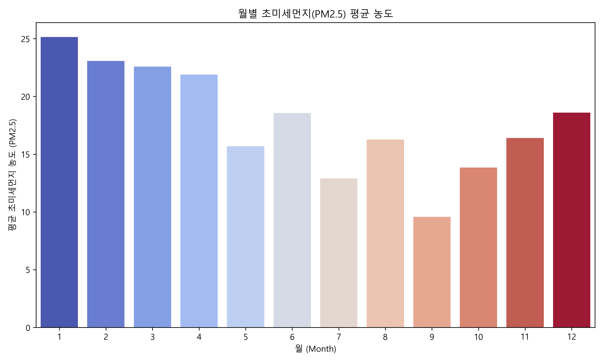

# 날짜와 가스데이터를 이용한 서울 성북구 초미세먼지(PM2.5) 예측

**Ridge 회귀 · Random Forest 비교 분석**

> 대한민국 공공데이터(대기오염) 기반 — 시계열 특성 반영, 피처 엔지니어링, 모델 비교

---

## 1. 표지
- 프로젝트 제목:
- 교과목명:
- 담당 교수명:
- 팀원(학번 / 이름):
- 제출일:
- 팀명:

## 3. 서론
연구 배경 및 필요성, 프로젝트 목표 등을 서술한다.

### 배경
초미세먼지(PM2.5)는 국민 건강 및 사회적 비용과 직결되는 중요한 환경 지표이다. 단기적 농도 예측은 취약계층 보호, 공공 경보, 환경 정책 수립에 기여할 수 있다. 가스 성분(NO2, O3, CO, SO2 등)은 PM2.5 형성에 영향을 주므로 이들만으로도 예측 가능한 모델 구축을 탐색한다.

### 프로젝트 목표
- 날짜(Time)와 가스 측정값을 입력으로 PM2.5(연속값)를 예측하는 모델 개발
- `Ridge`와 `Random Forest` 모델의 성능 비교 및 해석
- 시계열 특성(계절성·시차) 반영한 피처 엔지니어링과 시간 기반 검증 적용

## 4. 본론
프로젝트 수행 과정 및 적용 알고리즘을 상세히 기술한다. 표·다이어그램·그래프를 적극 활용.

### 4.1 관련 이론 및 기술
- **Ridge 회귀 (L2 정규화, Ridge Regression)**: 
    - **개념**: 기본 단순 선형 회귀는 오직 학습 데이터의 예측 오차(잔차 제곱합, RSS)만을 최소화하도록 학습됩니다. 하지만 이 과정에서 타겟 예측에 쓰이는 독립 변수가 많아지거나 변수들 간의 상관관계가 높을 경우, 모델의 회귀 계수(가중치)가 비정상적으로 커지면서 새로운 데이터에 무너지는 과적합(Overfitting) 문제가 발생합니다. **릿지 회귀**는 이러한 한계를 극복하기 위해, 모델의 비용 함수(Cost Function)에 예측 오차뿐만 아니라 '회귀 계수들의 제곱합(L2 Norm)'에 비례하는 페널티를 함께 더해 최적화하는 정규화(Regularization) 기법입니다. 즉, 모델이 학습 오차를 줄이려고 노력하면서도 동시에 가중치의 크기가 무분별하게 커지는 것을 스스로 억제하도록 두 가지 목표를 동시에 달성시키는 원리입니다.
    - **수식 및 설명**: 

      $$Cost = RSS + \alpha \sum_{j=1}^{p} w_j^2$$

      여기서 $RSS$는 잔차 제곱합(실제값과 예측값의 차이)을 의미하며, $w_j$는 각 독립 변수의 회귀 계수(가중치)를 뜻합니다. 수식 뒷부분의 $\alpha \sum_{j=1}^{p} w_j^2$가 바로 L2 페널티 항입니다. $\alpha$(알파) 값이 커질수록 회귀 계수의 제곱합에 더욱 강한 제약을 가하게 되므로, 모델은 전체 가중치 크기를 줄이는 방향(0에 가까워지게)으로 최적화됩니다.
    - **특징 및 장점**: 독립 변수들(가스 데이터 등) 간에 높은 상관관계가 존재할 때 회귀 계수가 비정상적으로 커지는 다중공선성(Multicollinearity) 문제를 효과적으로 통제할 수 있습니다. 계수의 크기를 전반적으로 0에 가깝게 축소시켜 모델의 분산(Variance)을 줄임으로써, 학습 데이터에 대한 과적합(Overfitting)을 방지하고 안정적인 일반화 성능을 도출합니다.
    - **주요 하이퍼파라미터**: 규제 강도를 조절하는 `alpha(α)` 파라미터 조절이 핵심으로, 알파 값이 클수록 제약이 강해져 파라미터들이 더 단단히 묶이게 되고, 작을수록 일반 단순 선형회귀 모델에 가까워집니다.
- **Lasso 회귀 (L1 정규화, Least Absolute Shrinkage and Selection Operator)**: 
    - **개념**: **라쏘 회귀**는 가중치의 제곱합을 페널티로 사용한 릿지와 달리, '회귀 계수들의 절댓값의 합(L1 Norm)'을 페널티로 부여하여 모델을 제어하는 정규화 기법입니다. 단순 선형 회귀가 가진 과적합의 위험을 방지하고 안정성을 높인다는 기본 목적은 릿지와 같으나, 제약 조건의 형태(L1 Norm)가 달라 모델 최적화 과정에서 영향력이 적은 독립 변수들을 다루는 방식에 큰 차이를 보입니다.
    - **수식 및 설명**: 

      $$Cost = RSS + \alpha \sum_{j=1}^{p} |w_j|$$

      릿지와 동일하게 예측 오차($RSS$)에 규제항을 더하여 비용 함수를 최소화하지만, 계수의 제곱 대신 절댓값인 $|w_j|$을 더하는 점이 다릅니다. 이 L1 페널티 항의 기하학적 형태(마름모꼴 구역)로 인해, 최적의 파라미터를 찾는 과정(Cost 최소화)에서 기여도가 낮은 변수의 회귀 계수 $w_j$가 정확하게 0과 교차하며 해를 가질 확률이 매우 높아집니다.
    - **특징 및 장점**: L1 정규화의 수학적 특성상 패널티가 커질수록 모델 결과에 기여도가 낮은 불필요한 독립 변수의 회귀 계수를 기하학적으로 완전히 '0'으로 수렴시킵니다. 이를 통해 모델이 스스로 가장 유의미한 변수만 남기게 되는 **자동 변수 선택(Feature Selection)** 기능과 모델의 **희소성(Sparsity)**을 유도하며, 모델을 직관적으로 해석하는 데 매우 유리합니다. 수많은 가스 종류 중 초미세먼지에 실질적으로 영향을 주는 요인만 식별하는 데 효과적입니다.
    - **주요 하이퍼파라미터**: 릿지와 동일하게 페널티 강도를 조절하는 `alpha(α)` 값을 세밀하게 튜닝하여, 과적합 제어와 설명력 사이의 균형(Trade-off)을 맞춥니다.
- **Random Forest 회귀 (앙상블 트리, Random Forest Regression)**: 
    - **개념**: 여러 개의 결정 트리(Decision Tree)를 만들고, 각 트리의 예측 결과를 종합하여 최종 값을 도출하는 앙상블(Ensemble) 알고리즘입니다. 훈련 데이터에서 무작위 샘플링을 진행(Bootstrap)하고 결과를 집계(Aggregation)하는 배깅(Bagging) 방식을 사용합니다.
    - **특징 및 장점**: 단일 트리가 가지기 쉬운 과적합 문제와 높은 분산(Variance) 문제를 여러 트리가 보완함으로써 상쇄시킵니다. 대기오염 데이터와 같이 비선형적이고 복잡한 패턴을 파악하는 데 적합하며, 변수 중요도(Feature Importance)를 통해 미세먼지에 가장 큰 영향을 미치는 요인을 해석하는 데도 유용합니다.
    - **주요 하이퍼파라미터**: 
        1) `n_estimators` (트리 수): 모델을 구성할 전체 결정 트리의 개수입니다. 무조건 많을수록 좋은 것은 아니며 적절한 연산 비용과 안정성의 타협점을 찾습니다.
        2) `max_depth` (최대 깊이): 각 트리가 뻗어 나갈 수 있는 최대 깊이를 제한하여 과도로 세분화되는 것을 방지합니다.
        3) `max_features` (무작위 특징 수): 각 노드에서 분할 기준을 찾을 때 고려할 피처의 개수로, 모델의 다양성을 확보하는 데 기여합니다.

#### 4.1.1 릿지(Ridge) 회귀와 라쏘(Lasso) 회귀의 핵심 차이점 비교
가중치 감소를 통한 과적합 방지라는 기본 목적은 같지만, 비용 함수에 적용하는 **페널티의 종류(L2와 L1)**에 따라 학습 결과에 결정적인 차이가 발생합니다.
- **가중치 축소 방식의 차이**:
  - **릿지(Ridge)**는 가중치의 크기에 비례하여 패널티를 부여하므로, 변수의 영향력이 적더라도 가중치를 완전히 0으로 만들지는 않고 크기만 줄입니다. 따라서 **모든 변수를 유지**한 채 예측을 수행하며, 변수들 간의 상관관계(다중공선성)를 완화하여 모델을 안정화하는 데 유리합니다.
  - **라쏘(Lasso)**는 가중치의 절댓값을 기준으로 패널티를 부여하여, 영향력이 적은 변수의 가중치를 수학적으로 **완전히 0으로 만듭니다**. 이를 통해 꼭 필요한 변수만 남기는 **자동 변수 선택(Feature Selection)** 효과를 얻을 수 있어, 결과 해석이 직관적이라는 장점이 있습니다. 다만 변수 간 상관관계가 높을 때 하나의 변수만 무작위로 선택할 위험성도 내포하고 있습니다.

### 4.2 데이터 설명 및 전처리

본 프로젝트에서는 대한민국 공공데이터 포털의 대기오염 관측 데이터(`한국환경공단_에어코리아_최종확정 측정자료_20241231.xlsx`)를 사용하였다.
데이터에는 측정일시에 따른 여러 가스와 미세먼지 농도 등의 정보가 포함되어 있다.
    :

전처리 과정으로 다음 작업을 수행하였다.
- 필요 변수(측정일시, 가스데이터, 미세먼지 데이터) 분리
    : 많은 변수 중 지역이 `성북구`인 데이터만 분리하였다.
- 파생 변수(월, 시간대) 추출
    : 문자열 형태의 `측정일시` 데이터를 바탕으로 모델이 학습할 수 있도록 정수형의 `월`과 `시간대` 특성을 추출하였다. 24시는 0시로 변환 처리하였다.
- 불필요한 변수 제거
    : 모델 예측과 무관한 식별 데이터(지역, 망, 측정소코드, 측정소명, 주소 등)와 타겟과 직결되는 변수(미세먼지(PM10))를 분석에서 제외하였다.
- 결측치 제거
    : 결측값이 하나라도 포함된 데이터 행은 모두 제거(`dropna()`)하여 완전한 데이터를 구성하였다.

### 4.3 모델 설계 및 실험 방법

본 프로젝트에서는 초미세먼지 농도를 예측하기 위해 세 가지 다른 회귀 모델(Ridge, Lasso, Random Forest)을 설계하여 비교 실험을 진행하였다. 정확한 모델링과 신뢰도 높은 평가를 위해 Scikit-learn 라이브러리를 기반으로 다음과 같은 구체적 실험 방법론을 적용하였다.

**1. 변수 선정 및 데이터 분할 (Data Splitting)**
- **독립 변수(X) 및 종속 변수(y)**: 전처리가 완료된 데이터에서 예측하고자 하는 타겟인 `초미세먼지(PM2.5)`를 종속 변수(y)로 분리하고, 나머지 가스 관측값(SO2, CO, O3, NO2)과 시간적 요인(월, 시간대)을 독립 변수(X)로 설정하였다.
- **Train/Test Split**: 전체 데이터를 모델 학습용(Train)과 일반화 성능 평가용(Test)으로 나누기 위해 8:2 비율로 분할하였다. 실험 결과의 일관성 및 재현성을 위해 난수 시드(`random_state=42`)를 고정하여 무작위 샘플링을 진행하였다.

**2. 특성 스케일링 (Feature Scaling)**
- 각 가스 측정치(ppm 등)와 시간 데이터의 범위 및 단위가 다르기 때문에, 이를 그대로 선형 모델에 투입할 경우 스케일이 큰 변수가 결과에 과도한 영향을 미칠 수 있다.
- 선형 회귀 계열 모델(Multiple Linear, Ridge, Lasso)은 스케일에 매우 민감하므로 데이터를 정규화하는 과정이 필수적이다. 따라서 Scikit-learn의 `StandardScaler`를 적용하여 모든 연속형 변수들이 평균 0, 분산 1을 가지도록 표준화(Standardization)를 수행한 후 학습을 진행하였다. (※ 단, 앙상블 트리 기반인 Random Forest는 스케일에 영향을 받지 않으므로 처리 여부가 유연하다.)

**3. 모델 상세 설계 및 하이퍼파라미터 튜닝**
- **Ridge 및 Lasso 회귀 모델 구축**:
    Scikit-learn의 `Ridge`, `Lasso` 모듈을 적용하였다. 정규화 모델의 핵심은 최적의 규제 강도(`alpha`)를 찾는 것이므로, 0.001, 0.01, 0.1, 1, 10 등 다양한 범위의 패널티 강도를 테스트하여 모델의 성능 변화를 관찰하며 최적화를 수행했다. (실제 실험에서는 Ridge 최적 alpha=1, Lasso 최적 alpha=0.001로 도출되었다.)
- **Random Forest 회귀 모델 구축**:
    비선형적인 시계열 데이터 패턴과 가스 모델 간 상호작용을 효과적으로 학습하기 위해 `RandomForestRegressor` 모델을 설계하였다. 무작위 트리의 개수는 100개(`n_estimators=100`)로 설정하여 앙상블 결과의 안정성을 도모하였고, 각 트리가 훈련 데이터의 노이즈까지 깊게 학습하는 과적합(Overfitting)을 방지하기 위해 트리의 뻗어나가는 깊이를 10(`max_depth=10`)으로 엄격히 제한하였다.

**4. 성능 평가 지표 및 해석 기법 (Metrics & Interpretation)**
- **평가 지표**: 예측 모델의 객관적인 성능을 측정하기 위해 회귀 분석의 대표적 지표인 평균 절대 오차(MAE, 오류의 실제 크기 파악), 루트 평균 제곱 오차(RMSE, 큰 오류에 페널티 부여), 결정 계수(R2-Score, 모델의 데이터 설명력 판별)를 산출하였다.
- **시각화 및 구조 해석**: 모델 학습이 완료된 후, 선형 모델들이 부여한 회귀 계수(Coefficient)의 절댓값 크기와 Random Forest에서 추출한 변수 중요도(Feature Importance)를 막대그래프(Bar plot) 형태 등으로 시각화하여, 초미세먼지 농도 예측에 결정적인 영향을 끼치는 핵심 인자(가스 종류, 계절/시간 등)를 도출하고 해석하였다.

### 4.4 실험 결과 및 분석

실제 구현 및 데이터 학습을 통해 도출된 회귀 모델들의 성능 평가 지표는 다음과 같습니다. 참고 지표로 다중선형회귀(Multiple Linear Regression)의 결과도 함께 기재하였습니다.

| Model | MAE | RMSE | R2-Score | 최적 하이퍼파라미터 |
| :--- | :---: | :---: | :---: | :--- |
| **다중선형회귀** | 6.194 | 8.420 | 0.517 | - |
| **Ridge 회귀** | 6.194 | 8.420 | 0.517 | alpha = 1 |
| **Lasso 회귀** | 6.194 | 8.420 | 0.517 | alpha = 0.001 |
| **Random Forest** | **5.195** | **7.088** | **0.658** | n_estimators=100, max_depth=10 |

- **결과 분석**: 
  - 실험 결과 다중선형회귀, 릿지, 라쏘 회귀 모델 모두 결정 계수(R2)가 0.517 수준으로 동일한 성능을 기록했습니다. 이는 주어진 데이터셋의 가스 변수들 간 다중공선성이 예측 성능에 큰 영향을 미칠 만큼 높지 않았기 때문으로 보입니다.
  - 반면 **Random Forest 회귀 모델**은 MAE 5.195, RMSE 7.088로 오차를 줄였고, 결정 계수(R2) 역시 **0.658**로 가장 높은 예측 성능을 달성했습니다. 초미세먼지 예측이 단순히 가스 농도들의 선형적 합(Linear)으로만 결정되기보다는, 여러 조건이 맞물리는 **비선형적 패턴(Non-linear Pattern)**의 영향을 크게 받는다는 것을 보여줍니다.

- **추가 시각화 자료**: 
  - **모델 성능 지표 종합 그래프 (Model Comparison)**
    각 모델별 성능(R2-Score)과 랜덤 포레스트의 세부 지표를 직관적으로 비교한 종합 타워입니다. 
    
    *설명: 좌측 R2 비교 막대그래프를 보면 선형 모델 3종(다중선형, 릿지, 라쏘)은 $R^2$가 0.517에서 정체된 반면, 랜덤 포레스트는 0.658로 성능이 크게 도약했음을 알 수 있습니다. 중앙의 산점도에서도 빨간색 대각선(실제=예측)을 따라 군집이 더 잘 모여있으며, 우측 그래프를 통해 일산화탄소(CO)가 가장 결정적인 변수로 쓰였음을 확인할 수 있습니다.*

  - **선형 모델(Ridge, Lasso)의 실제값 대비 예측 및 회귀계수 결과**
    선형 모델의 예측 한계점과 각 변수들이 부여받은 방향성 및 가중치(Coefficient)를 시각화한 결과입니다.
    
    *설명: 왼쪽 산점도에서 PM2.5 실제 농도가 높아질수록 모델이 이를 온전히 따라가지 못해 점들이 가로로 넓게 퍼지는 선형 모델의 한계를 뚜렷하게 보여줍니다. 오른쪽 회귀계수 비교 막대그래프에서는 모델 종류와 무관하게 일산화탄소(CO)가 초미세먼지 증가에 가장 큰 양(+)의 기여를 했으며, 반대로 월(Month) 변수는 음(-)의 기여를 가진 것으로 분석되었습니다.*

  - **Random Forest 단일 변수 중요도 분석 (Feature Importance)**
    비선형 모델이 여러 번의 분기를 거치며 초미세먼지 예측에 가장 크게 작용한 핵심 인자 순위를 도출한 그래프입니다. 
    
    *설명: 복잡한 상관관계 속에서도 '일산화탄소(CO)'가 다른 모든 변수들을 제치고 압도적인 1위 중요도를 차지했으며, 이어서 오존(O3) 농도와 계절성을 담은 월(Month) 변수 시계열 요소가 큰 비중을 차지함을 직접적으로 증명합니다.*

  - **월별 초미세먼지(PM2.5) 평균 농도 파악**
    모델이 시계열 요소인 '월(Month)' 변수를 왜 중요하게 생각했는지를 증명하는 평균 농도 결과 그래프입니다.
    
    *설명: 막대 높이를 보면 1월부터 4월(겨울~봄) 기간에는 난방, 황사 등의 영향으로 농도가 20 ㎍/m³ 이상으로 크게 치솟고, 비가 많이 오거나 대기 확산이 활발한 여름~가을(7~9월)에는 매우 낮은 쾌적한 상태가 되는 명확한 U자형 계절 패턴을 확인할 수 있습니다.*

## 5. 결론

본 프로젝트는 제한된 외부 기상 데이터 없이, 오직 시간 데이터(월, 시간대)와 측정소에서 관측된 주변 가스 측정치만을 활용하여 초미세먼지(PM2.5) 농도를 예측하는 프레임워크를 구축하고 여러 모델을 비교 평가하였습니다. 

- **수행한 프로젝트 내용 요약 및 최종 결과**: 
  - 공공데이터포털의 관측 데이터를 전처리한 뒤, **총 4개의 예측 모델(다중선형회귀, 릿지, 라쏘, 랜덤 포레스트)**을 학습시키고 MAE, RMSE, R2-Score 지표를 통해 성능을 평가하였습니다. 
  - 실험 결과 모든 선형회귀 계열(기본형 포함 릿지, 라쏘)은 $R^2$ 0.517의 성능을 낸 반면, 앙상블 기법으로 비선형적 패턴을 학습한 랜덤 포레스트(Random Forest)가 가장 우수한 지표($R^2=0.658$, MAE=5.195)를 산출했습니다.
- **주요 분석 결과와 프로젝트 수행 중 확인한 사항**:
  - 다중선형회귀와 패널티를 부여한 릿지, 라쏘 회귀의 최종 성능이 동일하게 나타난 것은, 본 데이터셋을 구성하는 각 가스 성분들 간에 서로 예측을 방해할 만큼의 강한 다중공선성(Multicollinearity) 문제가 존재하지 않았음을 보여줍니다. 동시에 초미세먼지는 단순 가스 농도의 선형적(Linear) 합으로는 예측하기 어렵다는 명확한 한계를 확인할 수 있었습니다. 
  - 예측 타겟인 **초미세먼지(PM2.5)를 증가시키는 주요 요인**을 분석해 본 결과, Random Forest 모델의 변수 중요도(Feature Importance) 및 피어슨 상관계수에서 공통적으로 **일산화탄소(CO) 농도가 가장 큰 영향력(상관계수 0.64)**을 끼치는 것으로 나타났습니다. 뒤이어 **이산화질소(NO2)**와 **아황산가스(SO2)** 순으로 밀접한 양의 상관관계를 보였습니다. 
  - 계절성의 경우 겨울에서 봄으로 향할수록 수치가 증가하고 여름과 가을에는 줄어드는 뚜렷한 음(-)의 상관관계(-0.24) 패턴을 보였습니다. 
  - 결론적으로 대기오염은 일산화탄소의 급증, 특정 계절 등 여러 요인이 복합적인 패턴을 보이며 발생하기 때문에, 다양한 조건 조합을 탐색하는 랜덤 포레스트 앙상블 기법이 훨씬 효과적임을 확인했습니다.
- **프로젝트의 한계점 및 향후 개선 방향**: 
  - 비선형 모델을 통해 설명력을 높였으나, 여전히 예측하지 못하는 약 34%의 오차가 존재합니다. 이는 강수량, 풍향, 온도와 같은 기후 요인이 배제되었기 때문입니다. 
  - 보다 정밀한 예측 경보 시스템을 구축하기 위해서는 현재 활용 중인 가스 데이터에 **기상청의 기상 관측 데이터를 결합**하는 과정이 필요합니다. 더불어 이전 시간대의 대기 상태가 현재에 미치는 영향을 고려하기 위해, 단순 회귀를 넘어 **LSTM, GRU 등 시계열 딥러닝 알고리즘**을 도입하는 방향으로 후속 연구를 확장해 볼 수 있습니다.

## 6. 참고문헌
- 대한민국 공공데이터포털, 대기오염 관측 데이터, https://www.data.go.kr/data/15122830/fileData.do
- IBM, "랜덤 포레스트(Random Forest)란?", https://www.ibm.com/kr-ko/think/topics/random-forest
- IBM, "라쏘 회귀(Lasso regression)란?", https://www.ibm.com/kr-ko/think/topics/lasso-regression#1190488335
- IBM, "릿지 회귀(Ridge regression)란?", https://www.ibm.com/kr-ko/think/topics/ridge-regression#1190488336
- Scikit-learn 공식 문서 (Ridge, Lasso, Random Forest)

